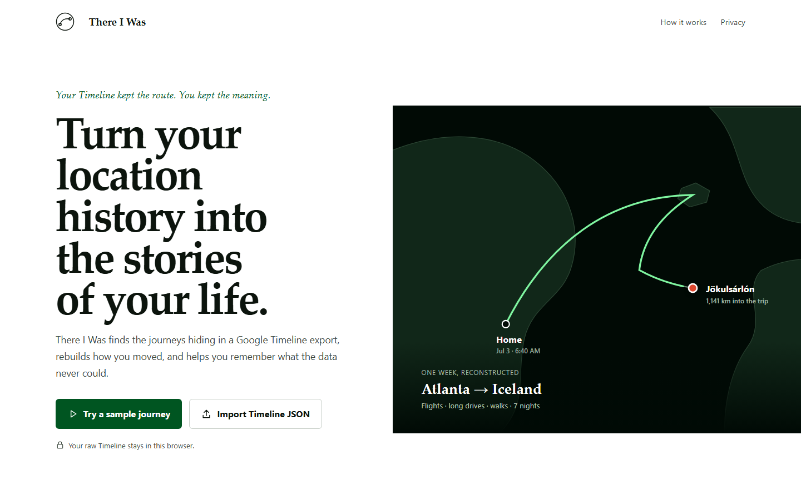
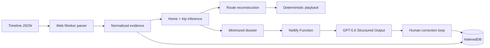

# There I Was

Turn your Google Timeline into cinematic, editable stories of your life.



**[Live demo](https://thereiwas.dalmo.ai)** · **[2:27 demo video](https://youtu.be/yNq8QA40OEM)** · Choose **Try a sample journey**—no account, API key, or private file required.

There I Was finds trips inside a Google Timeline JSON export, reconstructs each route with explicit provenance, and plays the journey back as a synchronized map, clock, odometer, movement trace, and story. The raw Timeline is parsed and persisted locally; GPT-5.6 receives only a bounded dossier for the selected trip. Built for **OpenAI Build Week 2026** in the **Apps for Your Life** category.

## What it does

- Imports the current Google Timeline JSON schema in a Web Worker.
- Normalizes visits, activities, path points, Timeline Memories, coordinates, numeric strings, and offset timestamps.
- Infers a likely home and detects vacations using explainable evidence.
- Lets the user confirm, dismiss, rename, resize, create, and delete trip records.
- Preserves observed, provider-enhanced, great-circle, and inferred route geometry separately.
- Replays the route with one deterministic animation clock, progressive drawing, a moving marker, local time, distance, mode, places, camera changes, and a 30-second cinematic cut.
- Uses GPT-5.6 Structured Outputs to create grounded chapters, highlights, captions, uncertainty notes, and reflection questions.
- Lets the human answer, edit, regenerate, and restore the story without losing provenance.

## Why it matters

Google Timeline is a rich record that behaves like a log. There I Was makes that record emotionally useful without pretending telemetry knows more than it does.

> The data supplies evidence. GPT-5.6 supplies narrative structure. The human remains the authority over memory.

The same pattern can serve years of dormant personal location history: anniversaries, family trips, moves, long drives, and ordinary days that only became important later.

## Try it

1. Open [thereiwas.dalmo.ai](https://thereiwas.dalmo.ai).
2. Choose **Try a sample journey**.
3. Open the detected Iceland trip and press **Play**.
4. Choose **Direct my memory**, answer a reflection question, and watch the story update.
5. Return to journeys, create a trip from any dates, then reload to confirm local persistence.

Sample mode follows the real import and derivation pipeline and makes no OpenAI or Mapbox request.

## How it works

1. A worker validates every Timeline record independently and quarantines malformed input.
2. Pure domain modules infer home, detect away episodes, merge brief gaps, guard against relocations, and explain each candidate.
3. Route selection preserves original path evidence, uses great-circle geometry for flights, can enhance routable sparse ground legs through Mapbox, and falls back honestly.
4. IndexedDB stores the normalized dataset, trip authority, route cache, story versions, and last meaningful view.
5. The selected trip becomes a coordinate-free Memory Dossier; a Netlify Function validates it, calls GPT-5.6 through the Responses API, validates the strict result, and returns no provider internals.

## Technical architecture



The React tree does not rerender every animation frame. Geometry, timestamps, cumulative distances, keyframes, and stop intervals are precomputed; playback uses binary search and direct SVG/HUD updates from a single `requestAnimationFrame` clock.

See [docs/architecture.md](docs/architecture.md) for data flow, trust boundaries, inference rules, and failure behavior.

## GPT-5.6 Memory Director

The server-side integration uses the official OpenAI JavaScript SDK, the Responses API, and Zod-backed Structured Outputs through `text.format`. The production default is `gpt-5.6`, overridable with `OPENAI_MODEL`.

The model receives only the selected trip’s dates, destination labels and durations, summarized legs, daily movement, coverage gaps, uncertainty, user notes, and reflection answers. It never receives the raw Timeline, full-resolution paths, home coordinates, unrelated dates, or media.

Every factual highlight and caption carries grounding IDs. Inferences and human-supplied memories have explicit certainty labels. A validated cached plan and deterministic local fallback make the judge flow reliable when the provider is unavailable.

## Privacy

- Raw Timeline JSON: read, parsed, normalized, and stored in the browser only.
- Mapbox: receives only coordinates required for the selected routing/geocoding job when a browser-safe token is configured.
- OpenAI: receives only a bounded, coordinate-free dossier for the selected trip.
- Home: represented as “Home” with no full-resolution coordinate in the dossier.
- Accounts and cloud sync: intentionally absent.

The in-product request inspector shows provider, purpose, minimized payload size, time, and status. See [docs/privacy.md](docs/privacy.md).

## Run locally

```bash
git clone https://github.com/DalmoMendonca/thereiwas.git
cd thereiwas
pnpm install
cp .env.example .env
pnpm dev
```

Node.js 24 LTS is recommended. Sample mode works without API keys. Use `pnpm generate:sample` to regenerate the non-sensitive fixture.

## Environment variables

```dotenv
# Browser-safe, URL-restricted public token
VITE_MAPBOX_ACCESS_TOKEN=

# Server-side only
OPENAI_API_KEY=

# Server-side default
OPENAI_MODEL=gpt-5.6
```

Run `npx netlify dev` when testing the live Memory Director function locally. Never expose `OPENAI_API_KEY` through a `VITE_` variable.

## Tests

```bash
pnpm test
pnpm typecheck
pnpm build
pnpm test:e2e
```

The suite covers coordinate and timestamp parsing, Timeline path reconstruction, hierarchy deduplication, home inference, trip boundaries, relocation/merge behavior, manual authority, route selection and fingerprints, distance-based timing, cinematic time allocation, dossier minimization, Memory Plan validation, local persistence, the complete sample golden path, and privacy network assertions.

## How Codex was used

Codex implemented the competition build in one primary session: schema and spec analysis, architecture, pure domain logic, interface, motion, OpenAI integration, tests, browser diagnosis, documentation, deployment, and submission preparation. The collaboration log includes mistakes instead of presenting a fictional straight line—for example, the first trip detector split a nested low-confidence visit into a duplicate candidate, which browser testing exposed and a regression test now protects.

See [docs/codex-collaboration.md](docs/codex-collaboration.md) and the representative commit history. The primary `/feedback` Session ID is recorded there for the Build Week submission.

## Limitations

- The competition build targets the current top-level Timeline export schema in the included fixture and acceptance contract, not every historical Takeout format.
- Enhanced directions and reverse geocoding require a URL-restricted Mapbox token; all modes have an explicit offline fallback.
- The in-memory server rate limiter is appropriate for a public demo, not a large authenticated service.
- The single-home inference model intentionally favors reliability over full residential history.
- Optional photo/video enrichment is deferred; Timeline-only storytelling is the complete core experience.

## Roadmap

The release deliberately excludes lifetime analytics, collaborative accounts, cloud sync, complex nested trips, media libraries, hosted story pages, and video rendering. See [docs/post-hackathon-roadmap.md](docs/post-hackathon-roadmap.md) for the ordered post-competition plan.

## License

[MIT](LICENSE) © 2026 Dalmo Mendonca.
