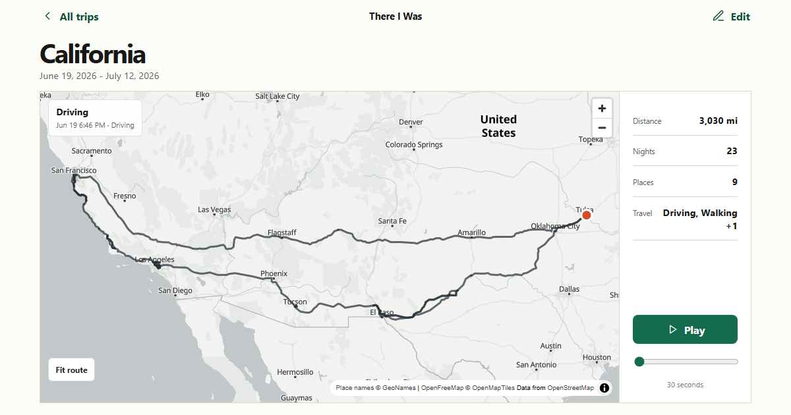

# There I Was



[Try the live app](https://thereiwas.dalmo.ai) · Built for OpenAI Build Week, Apps for Your Life

Google Timeline already knows where I went, how long I stayed, and how I moved. I wanted to press Play. There I Was imports a Timeline JSON export, finds trips between returns home, names the places that mattered, and rebuilds each trip as a route you can replay. GPT-5.6 turns one selected trip's evidence into an editable story draft without inventing what happened.

## Try it

Click **Try with Sample Data**. The sample is a pared-down, consented excerpt of my own Timeline containing three trips: California, New York, and Italy. It runs through the same parser and trip detector as an upload. No made-up journey is bundled with the app.

To use your own history:

```text
Google Maps app > Settings > Location & privacy > Export Timeline data
```

Import the JSON file on the landing page. The file stays in your browser.

## What it does

- Detects trips from real departures and returns to Timeline's semantic Home records.
- Titles each trip by its main city, state, or country, then lists significant cities in order.
- Keeps recorded paths when they are detailed and uses Mapbox Directions to replace sparse ground segments with road or walking geometry.
- Reconstructs missing joins so every trip starts at home and finishes at home.
- Plays the route in 30 seconds with a moving marker, a trailing line, local date and time, and compact trip stats in miles.
- Imports geotagged photos, reads EXIF date and GPS data locally, and synchronizes each photo with its map position and replay time.
- Uses GPT-5.6 to draft chapters and reflection questions from named places, dates, travel modes, and summarized movement.

## Why I built it

Timeline gives people a detailed personal record and a weak way to revisit it. A useful memory tool has to preserve three different kinds of authorship: the data supplies evidence, GPT-5.6 organizes that evidence, and the person decides what the trip meant.

## How it works

1. A Web Worker validates and normalizes visits, activities, path points, and Timeline Memories.
2. A local GeoNames index resolves coordinates to cities, regions, and countries.
3. Semantic Home returns define trip boundaries. Exact date ranges are deduplicated.
4. Mapbox Directions handles sparse driving, walking, and cycling evidence. Recorded paths remain recorded. Route gaps are rebuilt and cached in IndexedDB.
5. MapLibre renders the full loop over OpenFreeMap tiles. One animation clock controls the marker, route progress, timestamp, and photo moments.
6. The selected trip becomes a coordinate-free Memory Dossier. A Netlify Function validates it, calls the OpenAI Responses API with `store: false`, and validates the structured result again.

More detail is in [docs/architecture.md](docs/architecture.md).

## GPT-5.6 Memory Director

The model receives one bounded dossier. The original export stays in the browser. The dossier can include named destinations, dates, duration, modes, coverage gaps, and answers the user typed. The prompt forbids invented activities, companions, purpose, emotion, weather, and events. Every response must match a strict Zod schema.

Provider errors return a deterministic draft from the same named evidence, so the button still produces something useful. The live production endpoint is configured for `gpt-5.6`.

## Photos

Photo files stay in IndexedDB. `exifr` reads capture time and GPS metadata in the browser. The app rejects files without a usable location or a date near the selected trip, places accepted photos on the map, and shows the matching image during playback. Photos are never sent to OpenAI, Mapbox, or Netlify.

## Privacy

- The Timeline JSON is parsed and stored locally.
- OpenAI receives no coordinates, raw path points, home location, unrelated dates, or photo bytes.
- Mapbox receives only the coordinates needed to route sparse segments and missing joins for the trip the user opens.
- The OpenAI key stays in the Netlify Function. Only the public Mapbox browser token is bundled with the client.
- **Delete imported data** clears trips, route cache, story drafts, and photos from IndexedDB.

The public sample contains selected coordinates from my own export and is published with my consent. See [docs/privacy.md](docs/privacy.md) for the complete boundary.

## Run locally

Node.js 22.12 or newer is required. Node 24 is used for release verification.

```bash
git clone https://github.com/DalmoMendonca/thereiwas.git
cd thereiwas
pnpm install
cp .env.example .env
pnpm dev
```

Environment variables:

```dotenv
VITE_MAPBOX_ACCESS_TOKEN=
OPENAI_API_KEY=
OPENAI_MODEL=gpt-5.6
```

Use `npx netlify dev` when testing the server-side story function locally.

## Tests

```bash
pnpm typecheck
pnpm test
pnpm build
pnpm test:e2e
pnpm test:privacy
```

The committed sample test requires exactly three trips with the expected titles and dates. The private acceptance suite imports 15,989 Timeline records, verifies 28 unique named trips, opens the California replay, and checks playback. Unit coverage includes parsing, home inference, trip boundaries, route selection, loop closure, photo metadata, dossier minimization, and structured story validation.

## How Codex was used

The main Build Week task contains the spec, implementation, browser tests, visual revisions, deployment work, and submission rewrite. [The collaboration log](docs/codex-collaboration.md) records the bugs too, including duplicate trip ranges, missing production secrets, sparse routes drawn as chords, and a production minifier failure inside the map bundle.

## Limits

The importer targets the current Google Maps mobile Timeline export. Old Takeout schemas need separate adapters. Place names come from an offline city index, so small towns and neighborhoods can resolve to a nearby city. First-time route reconstruction needs network access to Mapbox and can take several seconds on a long trip.

## Roadmap

Next steps are broader export compatibility, editable place labels, better camera direction during playback, and an exportable recap after the final story and captions can be reviewed.

## Data and license

Place names come from [GeoNames](https://www.geonames.org/) under CC BY 4.0. The map uses [OpenFreeMap](https://openfreemap.org/) vector tiles derived from [OpenStreetMap contributors](https://www.openstreetmap.org/copyright), with attribution in the app.

[MIT](LICENSE) © 2026 Dalmo Mendonca.
